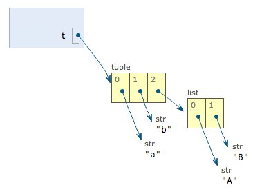

Python 内置数据类型包括 `list`, `tuple`, `dict`, `set`

## List

Python内置的一种数据类型是列表：list。list是一种有序的集合，可以随时添加和删除其中的元素

列表常用操作及其复杂度

Operation  | big O | description |
--|-- |-- |
index [] |	O(1) |	索引操作
index assignment	|	O(1)| 	索引赋值操作
append	|	O(1)|	在列表末尾添加新的对象
pop()	|	O(1)|	移除列表中的一个元素（默认最后一个元素），并且返回该元素的值
pop(i)	|	O(n)|	移除列表中索引位置的值，并且返回该元素的值
insert(i,item)	|	O(n)|	将对象插入列表索引i位置
del operator	|	O(n)|	删除列表的的元素
iteration	|	O(n)|
contains (in)	|	O(n)|
get slice [x:y]	|	O(k)|
del slice	|	O(n)|
set slice	|	O(n+k)|
reverse	|	O(n)|	反向列表中元素
remove | O(n) | 移除列表中某个值的第一个匹配项
concatenate	|	O(k)|
sort	|	O(n log n)|	列表排序
multiply	|	O(nk)|


<!-- more -->


## Dictionary

Python内置了字典：dict的支持，dict全称dictionary，在其他语言中也称为map，使用键-值（key-value）存储，具有极快的查找速度。dict内部存放的顺序和key放入的顺序是没有关系的。
dict的key必须是**不可变对象**。这是因为dict根据key来计算value的存储位置，如果每次计算相同的key得出的结果不同，那dict内部就完全混乱了。这个通过key计算位置的算法称为**哈希算法**（Hash）

dict: `{'A': 1, 'Z': -1}` 创建方式

``` python
a = dict(A=1, Z=-1)
b = {'A': 1, 'Z': -1}
c = dict(zip(['A', 'Z'], [1, -1]))
d = dict([('A', 1), ('Z', -1)])
e = dict({'Z': -1, 'A': 1})
a == b == c == d == e
# True
```

和list比较，dict有以下几个特点：

- 查找和插入的速度极快，不会随着key的增加而变慢；
- 需要占用大量的内存，内存浪费多。

而list相反：

- 查找和插入的时间随着元素的增加而增加；
- 占用空间小，浪费内存很少。

所以，dict是用空间来换取时间的一种方法

遍历一个`dict`，实际上是在遍历它的所有的Key的集合，然后用这个Key来获得对应的Value

``` python
d = {'Adam': 95, 'Lisa': 85, 'Bart': 59, 'Paul': 75}

print d['Adam']
# 95
print d.get('Jason')
# None

for key in d :
    print key, ':', d.get(key)
# Lisa : 85
# Paul : 75
# Adam : 95
# Bart : 59
```

## Tuple

`tuple`和`list`非常类似，但是tuple一旦初始化就不能修改

#### Tuple 的不可变性

元组一旦创建，它的元素就是不可变的， 例如如下：

``` python
t = ('a', 'b', ['A', 'B'])
t[2][0] = 'X'
t[2][1] = 'Y'
print t
```



当我们把list的元素'A'和'B'修改为'X'和'Y'后，tuple变为：


Tuple的每个元素，指向永远不变，其中如果某个元素本身是可变的，那么元素内部也是可变的，但是元组的指向却是没有变化


## Set

`set`和`dict`类似，也是一组key的集合，但不存储value。由于key不能重复，所以，**在set中，没有重复的key**。


`set`可以看成数学意义上的无序和无重复元素的集合，因此，两个set可以做数学意义上的交集、并集等操作：

``` python
s1 = set([1, 2, 3])
s2 = set([2, 3, 4])

s1 & s2
# set([2, 3])
s1 | s2
# set([1, 2, 3, 4])
```

set和dict的唯一区别仅在于没有存储对应的value，但是，set的原理和dict一样，
所以，同样不可以放入可变对象，因为无法判断两个可变对象是否相等，也就无法保证set内部“不会有重复元素”。试试把list放入set，看看是否会报错。